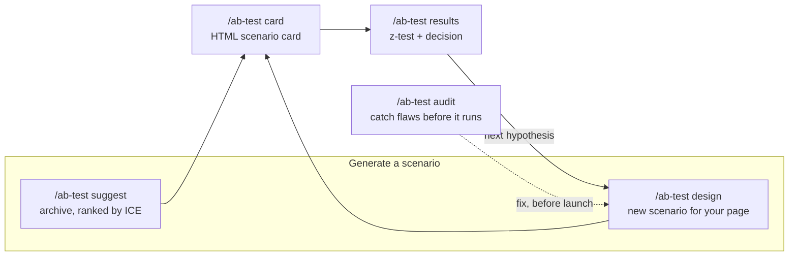
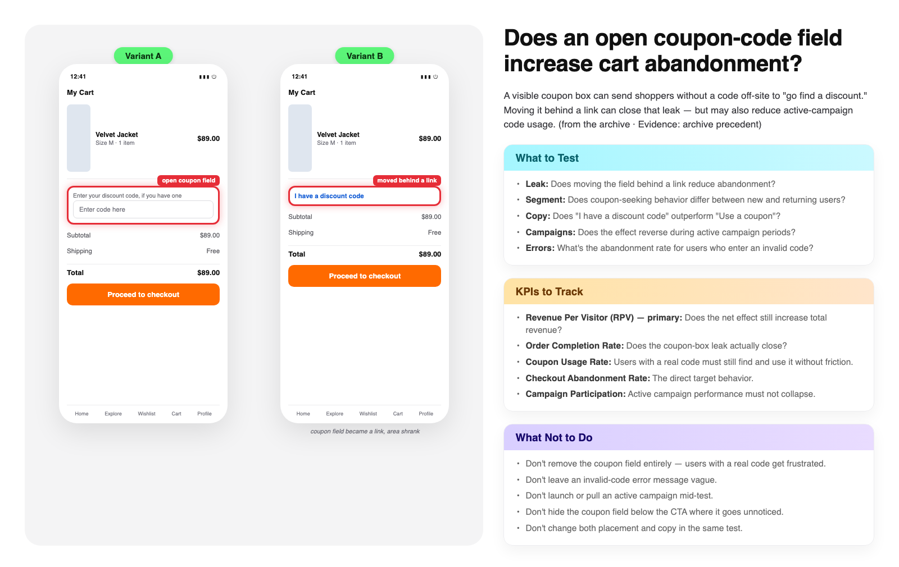

# ab-test-playbook — A/B testing & CRO playbook with 182 experiment scenarios

[](https://github.com/ali-demirbas/ab-test-playbook/actions/workflows/validate.yml)
[](LICENSE)


**Language:** [English](README.md) · [Türkçe](README.tr.md)

> [!NOTE]
> Official source: this repository, [ali-demirbas/ab-test-playbook](https://github.com/ali-demirbas/ab-test-playbook), and `npx skills add ali-demirbas/ab-test-playbook`. A couple of unrelated repos on skills.sh happen to use a similarly named skill — they aren't this project.

[Jump to install ↓](#install)

A practical A/B testing and CRO (conversion rate optimization) playbook for e-commerce, mobile apps, SaaS and digital products — powered by Claude Code. Suggests proven experiment ideas by journey stage, designs new ones in a disciplined single-variable framework, audits existing test plans for methodological flaws (confounds, missing guardrails, p-hacking risk), and renders every scenario straight to a deck-style HTML card — no extra ask needed.

Built from an archive of A/B test scenarios and hypothesis-generation patterns used in real e-commerce, mobile app and SaaS growth work — 182 scenarios, methodology and text content, not a shipped visual deck. Covers experiment design, test prioritization (ICE scoring), statistical significance and sample-size math, guardrail metrics, and checkout/product-page/pricing optimization. Every scenario follows the same three-box discipline:

- **Test edilmesi gerekenler** — what questions the experiment must answer
- **Takip edilecek ana KPI’lar** — one primary metric + guardrails that must not degrade
- **Yapılmaması gerekenler** — the mistakes that invalidate the test

**Zero-install demo:** see a real scenario card — two mockups differing in exactly one thing, the tested element boxed, and the three boxes filled — at [ali-demirbas.github.io/ab-test-playbook](https://ali-demirbas.github.io/ab-test-playbook/). It is the actual output of `scripts/build_card.py`, not a picture of one.

## Why a playbook instead of ad-hoc testing

| Without a system | With ab-test-playbook |
|---|---|
| Test ideas come from memory or whatever feels right today | Ranked by ICE from a 182-scenario archive, or generated with a stated mechanism — "more eye-catching" isn't an accepted reason |
| "Looks significant" is a judgment call from staring at two percentages | A real two-proportion z-test, confidence interval, sample size, and an SRM check — computed by script, never eyeballed |
| Five metrics get watched, none of them decides anything | One named primary metric, one mandatory guardrail — p-hacking risk gets flagged, not shipped |
| The model that wrote the scenario also grades its own homework | An adversarial critic checks methodology before a card renders; a second reviewer checks the visual for a hidden second difference |
| A price or discount test reads conversion rate alone | Revenue and margin check runs automatically — conversion up while revenue per visitor drops is the finding, not a footnote |
| A dark pattern ships if a user asks for one | Refused even on request, with the reason stated in the output |
| What you tried before lives in someone's memory, if anywhere | `.abtest-history.md` — the skill reads it and won't re-suggest what already lost without a stated reason |

## Questions this playbook helps answer

- What A/B tests should I run on my e-commerce checkout or cart?
- What should I test on a product detail page (PDP)?
- How do I formulate an A/B test hypothesis with real evidence behind it?
- What metrics should I track as guardrails in an A/B test?
- How many visitors do I need for statistical significance? (real z-test math, not a guess)
- What are common A/B testing mistakes that invalidate a result?
- How do I prioritize which CRO experiments to run first?
- What should I A/B test in a SaaS pricing page or onboarding flow?
- Is my test plan set up correctly, or does it have a confound?



## Install

In Claude Code:

```
/plugin marketplace add ali-demirbas/ab-test-playbook
/plugin install ab-test-playbook@ab-test-playbook
```

Or clone and add as a local plugin:

```bash
git clone https://github.com/ali-demirbas/ab-test-playbook.git
claude --plugin-dir ./ab-test-playbook
```

Or install individual skills with the [skills CLI](https://skills.sh):

```bash
npx skills add ali-demirbas/ab-test-playbook --all
```

Already have [claude-lifecycle](https://github.com/ali-demirbas/claude-lifecycle) too? Add [claude-skills](https://github.com/ali-demirbas/claude-skills) once instead of each repo separately: `/plugin marketplace add ali-demirbas/claude-skills`.

Using [Gemini CLI](https://github.com/google-gemini/gemini-cli) instead? `.gemini/extensions/ab-test-playbook/` ships the same skills, rules and review agents, generated from the same source files by `scripts/build_gemini.py`:

```bash
git clone https://github.com/ali-demirbas/ab-test-playbook.git
cd ab-test-playbook/.gemini/extensions/ab-test-playbook && gemini extensions link .
```

## Usage

| You say | What happens |
|---|---|
| `/ab-test suggest` — "suggest tests for my checkout page" | Picks matching scenarios from the archive, ranks by ICE, ships each as an HTML card |
| `/ab-test design` — "design a test for this" (+ screenshot/URL) | Designs a new single-variable scenario for your page in the same framework |
| `/ab-test audit` — "is this test set up correctly?" | Audits a plan or variant pair: confounds, missing guardrails, p-hacking risk, unrealistic duration |
| `/ab-test results` — "interpret these results" / "how many visitors do I need" | Runs a real two-proportion z-test on your numbers (significance, CI, lift) or calculates required sample size — math via script, never eyeballed — then states the decision and what happens next (staged rollout, guardrail watch, or the follow-up experiment) |
| `/ab-test card` — "turn this into a card" | Renders the scenario as a single-file HTML card (Variant A/B wireframes + three boxes) |

When you share a page, the router asks exactly one multiple-choice question — which problem you're solving — and nothing else up front; no traffic, tool, or setup questions before it produces a scenario. Sample-size or duration numbers appear only when real traffic data exists — volunteered by you, or asked for when you request them. If you shared a screenshot or page, brand colors are taken straight from it with no question; otherwise it asks once, before the first card, whether to upload a brand guide — say no and it uses a neutral palette. Every scenario a run produces (2-5 of them, whether from `suggest` or `design`) becomes its own HTML card immediately — the three boxes live in the card, not as duplicate chat text. More than 5 strong candidates in one run gets flagged and confirmed before generating the rest.

## What a session looks like

A product-page example, end to end:

**You:** share a screenshot of a product page.

**It asks once:** a single multiple-choice question — which problem you're trying to solve (users start the flow but don't finish / never start / arrive but convert poorly / no specific problem, just look). No traffic, tool, or setup questions up front; those aren't needed to produce a scenario and only get asked if you later ask about sample size or duration.

**It returns** 2-5 full scenarios directly — no "which one should I expand" round-trip — each rendered straight to a self-contained HTML card (Variant A/B mockup + the three boxes, primary KPI marked, guardrails in "must not degrade" form) so the chat itself only carries a title and a one-line summary with the evidence label — `Kanıt: arşiv emsali` when it is a known pattern, `Kanıt: sezgi` when it is a hunch, said out loud rather than dressed up. Variant A is the page exactly as shown, never redesigned. More than 5 strong candidates? It says so and asks before generating the rest.

<p align="center">
  
</p>

<p align="center"><sub>A card generated from an archived scenario — fictional product and store, neutral palette (no brand guide was supplied). This is what `ab-test card` renders for every scenario, not a hand-built mockup. <a href="https://ali-demirbas.github.io/ab-test-playbook/">Live, zero-install version →</a> · source in <a href="examples/">examples/</a></sub></p>

**Each scenario ships with** the single-variable hypothesis, Variant A/B definitions, and a tool-agnostic setup spec (audience, split, exposure event, guardrail events, attribution window, decision rule) — named in your tool's vocabulary if you mention one, kept as chat text — plus the card itself (brand colors pulled from your screenshot when you shared one; otherwise a one-time brand-guide question, with a neutral palette as the fallback).

**Test finishes, you paste the numbers** → a real two-proportion z-test runs (never eyeballed), and because this was a price test it also runs the revenue check: conversion up 12% while revenue per visitor drops 4.8% is the finding, not a footnote. Then it states the decision and what happens next — staged rollout with a guardrail watch, or the follow-up experiment if there was no difference.

## What's inside

```
skills/          ab-test (router) + suggest / design / audit / results / card
agents/          scenario-critic — adversarial methodology review before a scenario is rendered
                 mockup-reviewer — checks the two mockups differ in exactly one thing
knowledge/       methodology.md · mockup-style.md
                 scenarios/ — curated scenarios by journey stage (TR)
scripts/         analyze_results.py — z-test, sample size, revenue/margin check, sample-ratio-mismatch check (stdlib-only)
                 validate_scenarios.py — format check for the scenario archive
                 build_card.py — deterministic card render: fills the template, escapes text, self-verifies against drift
                 validate_scenario_json.py — checks a scenario against the schema (one primary KPI, a guardrail, two variants)
                 validate_input.py — flags instruction-shaped text and script payloads in anything you paste in
                 validate.sh — repo consistency: frontmatter, internal links, plugin-root refs, rule citations
templates/       scenario-card.html · abtest-history.md — test memory template
                 scenario.schema.json — tool-agnostic test definition, portable to any experimentation platform
tests/           unit tests for the stats engine, the validators and the card builder
evals/           manual acceptance tests for the four core flows (suggest / design / audit / results)
examples/        a real end-to-end scenario → card render, with the matching chat-side output
docs/            architecture.md · the live zero-install demo (GitHub Pages)
```

See [FAQ.md](FAQ.md) for answers to common A/B testing and CRO questions, drawn from this playbook's own methodology.

Contributing a scenario: follow the three-box format of the existing files, then run the validator — it enforces five items per box, a guardrail in the KPI list, a device/segment question, and typographic rules.

```bash
python3 scripts/validate_scenarios.py
```

## Test memory

Keep a `.abtest-history.md` in your project (copy `templates/abtest-history.md`) and the skills read it before suggesting, designing, or auditing: they will tell you when you have already run this variable on this page and what came of it, stop re-proposing a pattern that already won, and switch to a structural change when the same element keeps returning no difference. After each result, `/ab-test results` hands you the row to paste in.

A past loss is information, not a veto — if the page has since changed, or the earlier run was underpowered or invalid, the scenario comes back with the reason stated. The file is yours and stays out of this repo; it is gitignored here.

## Hard rules (CLAUDE.md)

Every output honors these, non-negotiable: one variable per test, one primary KPI, at least one guardrail, no dark patterns, no fake reference prices, no duration estimates without traffic data, and an explicit evidence label on every recommendation — including "this is intuition, treat it as low confidence."

Two of them are enforced in code rather than prose: every generated scenario passes an adversarial review agent before it is rendered, and anything you paste in is scanned for instruction-shaped content first — text you supply is data, never an instruction ([architecture](docs/architecture.md)).

## Language

Scenario content is Turkish (the archive's native language). The skills answer in whatever language you use; metric abbreviations (CR, AOV, LCP, SQL) are kept as-is.

## Scope

What this is: a scenario archive, a disciplined design/audit methodology, and a real stats engine (`scripts/analyze_results.py` — z-test, confidence interval, sample size, sample-ratio-mismatch check) for interpreting numbers you paste in.

What this isn't: it doesn't connect to a data warehouse or analytics tool (GA4, Mixpanel, PostHog, BigQuery) to pull live numbers on its own, and it doesn't monitor a running test in real time — you bring the numbers when you have them.

## License

MIT — use it, adapt it, send a scenario back if you've got a good one. If it saves you from shipping a bad test, a star helps the next person find it.
