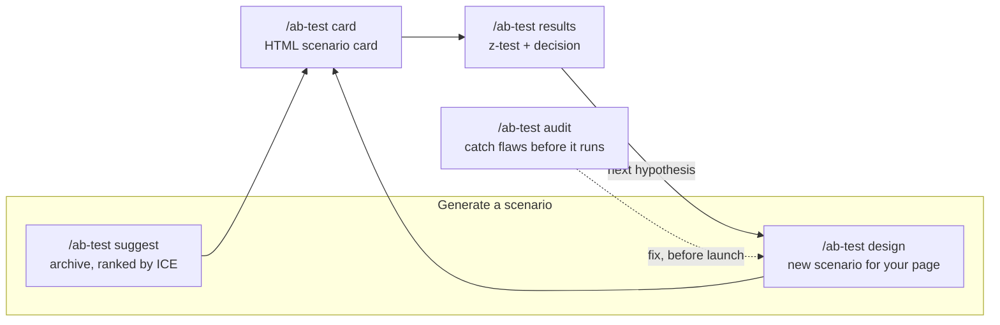

# ab-test-playbook — A/B testing & CRO playbook with 221 experiment scenarios

[](https://github.com/ali-demirbas/ab-test-playbook/actions/workflows/validate.yml)
[](LICENSE)


**Language:** [English](README.md) · [Türkçe](README.tr.md)

[Jump to install ↓](#install)

A practical A/B testing and CRO (conversion rate optimization) playbook for e-commerce, mobile apps, SaaS and digital products — powered by Claude Code. Suggests proven experiment ideas by journey stage, designs new ones in a disciplined single-variable framework, audits existing test plans for methodological flaws (confounds, missing guardrails, p-hacking risk), and renders every scenario straight to a deck-style HTML card — no extra ask needed.

Built from an archive of A/B test scenarios and hypothesis-generation patterns used in real e-commerce, mobile app and SaaS growth work, plus regulated finance, insurance and private-pension flows — 221 scenarios, methodology and text content, not a shipped visual deck. Covers experiment design, test prioritization (ICE scoring), statistical significance and sample-size math, guardrail metrics, and checkout/product-page/pricing optimization. Every scenario follows the same three-box discipline:

- **Test edilmesi gerekenler** — what questions the experiment must answer
- **Takip edilecek ana KPI’lar** — one primary metric + guardrails that must not degrade
- **Yapılmaması gerekenler** — the mistakes that invalidate the test

**Zero-install demo:** see a real scenario card — two mockups differing in exactly one thing, the tested element boxed, and the three boxes filled — at [ali-demirbas.github.io/ab-test-playbook](https://ali-demirbas.github.io/ab-test-playbook/). It is the actual output of `scripts/build_card.py`, not a picture of one.

> [!NOTE]
> Official source: this repository, [ali-demirbas/ab-test-playbook](https://github.com/ali-demirbas/ab-test-playbook). A couple of unrelated repos in public skill directories happen to use a similarly named skill; they aren't this project.

## Why a playbook instead of ad-hoc testing

| Without a system | With ab-test-playbook |
|---|---|
| Test ideas come from memory or whatever feels right today | Ranked by ICE from a 221-scenario archive, or generated with a stated mechanism — "more eye-catching" isn't an accepted reason |
| "Looks significant" is a judgment call from staring at two percentages | A real two-proportion z-test (exact test when counts are small), confidence intervals, sample size, A/B/n correction and an SRM check — computed by script, never eyeballed, and read against the direction you declared: a significantly *worse* variant is reported as a loser, never as "significant, ship it" |
| Five metrics get watched, none of them decides anything | One named primary metric, one mandatory guardrail that measures an independent harm — p-hacking risk gets flagged, not shipped |
| The model that wrote the scenario also grades its own homework | An adversarial critic checks methodology before a card renders; a second reviewer checks the visual for a hidden second difference |
| A price or discount test reads conversion rate alone | It asks for order value (and the variant's margin) and runs a revenue and margin check — conversion up while revenue per visitor drops is the finding, not a footnote |
| A dark pattern ships if a user asks for one | Refused even on request, with the reason stated in the output |
| What you tried before lives in someone's memory, if anywhere | `.abtest-history.md` — the skill reads it and won't re-suggest what already lost without a stated reason |

## Questions this playbook helps answer

- What A/B tests should I run on my e-commerce checkout or cart?
- What should I test on a product detail page (PDP)?
- How do I formulate an A/B test hypothesis with real evidence behind it?
- What metrics should I track as guardrails in an A/B test?
- How many visitors do I need for statistical significance? (real z-test math, not a guess)
- What are common A/B testing mistakes that invalidate a result?
- How do I prioritize which CRO experiments to run first?
- What should I A/B test in a SaaS pricing page or onboarding flow?
- Is my test plan set up correctly, or does it have a confound?


```mermaid
flowchart LR
    subgraph Generate["Generate a scenario"]
        S["/ab-test suggest\narchive, ranked by ICE"]
        D["/ab-test design\nnew scenario for your page"]
    end
    C["/ab-test card\nHTML scenario card"]
    R["/ab-test results\nz-test + decision"]
    A["/ab-test audit\ncatch flaws before it runs"]

    S --> C
    D --> C
    C --> R
    R -->|next hypothesis| D
    A -.->|fix, before launch| D
```

## Install

**Requirements:** Claude Code, and `python3` 3.9 or newer on your PATH. The scripts use the Python standard library only; there is nothing to `pip install`. One optional extra: the card's visual check (`scripts/render_check.mjs`) needs Node and Playwright with Chromium; without them cards still build and the check is skipped.

In Claude Code:

```
/plugin marketplace add ali-demirbas/ab-test-playbook
/plugin install ab-test-playbook@ab-test-playbook
```

Or clone and add as a local plugin:

```bash
git clone https://github.com/ali-demirbas/ab-test-playbook.git
claude --plugin-dir ./ab-test-playbook
```

**Skills only, limited.** The skills CLI can copy the six skill instructions on their own:

```bash
npx skills add ali-demirbas/ab-test-playbook --all
```

That route ships each skill's `SKILL.md` and nothing else: no binding rules (`CLAUDE.md`), no scenario archive, no scripts, no review agents. Every skill resolves those through the plugin root, so archive suggestions, the statistics engine and card rendering won't work. Use the plugin install above for the full engine.

Using [Gemini CLI](https://github.com/google-gemini/gemini-cli) instead? `.gemini/extensions/ab-test-playbook/` ships the same skills, rules and review agents, generated from the same source files by `scripts/build_gemini.py`:

```bash
git clone https://github.com/ali-demirbas/ab-test-playbook.git
cd ab-test-playbook/.gemini/extensions/ab-test-playbook && gemini extensions link .
```

## Usage

| You say | What happens |
|---|---|
| `/ab-test suggest` — "suggest tests for my checkout page" | Picks matching scenarios from the archive, ranks by ICE, ships each as an HTML card |
| `/ab-test design` — "design a test for this" (+ a screenshot, a URL or a description of your own page) | Designs a new single-variable scenario for your page in the same framework |
| `/ab-test audit` — "is this test set up correctly?" | Audits a plan or variant pair: confounds, missing or mis-specified guardrails, regulated-area and compliance gates, p-hacking risk, unrealistic duration |
| `/ab-test results` — "interpret these results" / "how many visitors do I need" | Checks the traffic split for SRM first, then runs the statistics on your numbers: significance (z-test, Fisher exact for rare events, Holm correction for A/B/n), continuous metrics like revenue per visitor (Welch, bootstrap, CUPED), an optional Bayesian view, or the required sample size. A pre-registration block, if you have one, is read back field by field (direction, alpha, guardrail margins, lagging windows, pass/fail checks). Math via script, never eyeballed; then it states the decision and what happens next (staged rollout, guardrail watch, or the follow-up experiment) |
| `/ab-test card` — "turn this into a card" | Renders the scenario as a single-file HTML card (Variant A/B wireframes + three boxes) |
| `/ab-test` on its own | Shows a five-line menu with one example prompt per subcommand, and asks nothing |

When you share a page (a screenshot, a URL, or a description of your own page), the router asks exactly one multiple-choice question — which problem you're solving — and nothing else up front; no traffic, tool, or setup questions before it produces a scenario. If your message already states the problem, the question is skipped. Sample-size or duration numbers appear only when real traffic data exists — volunteered by you, or asked for when you request them. The brand source never blocks: if you shared a screenshot or page, brand colors are taken straight from it; otherwise a neutral palette is used, with a one-line note under the card offering a rebrand if you send a brand guide. No question, no waiting. Every scenario a run produces (1-5 of them, whether from `suggest` or `design`) becomes its own HTML card immediately; the three boxes live in the card, not as duplicate chat text. The set is never padded: one strong scenario is a complete answer, and a weak candidate is not added to reach a count. A test you explicitly ask for is always produced, with its weakness stated and a stronger alternative named. With more than 5 strong candidates, the top 5 are produced and the rest offered in one line. A turn asks at most one question; anything else it needs is stated as an assumption and asked later.

## What a session looks like

A product-page example, end to end:

**You:** share a screenshot of a product page.

**It asks once:** a single multiple-choice question — which problem you're trying to solve (users start the flow but don't finish / never start / arrive but convert poorly / no specific problem, just look). No traffic, tool, or setup questions up front; those aren't needed to produce a scenario and only get asked if you later ask about sample size or duration.

**It returns** 1-5 full scenarios directly — no "which one should I expand" round-trip — each rendered straight to a self-contained HTML card (Variant A/B mockup + the three boxes, primary KPI marked, guardrails in "must not degrade" form) so the chat itself only carries a title and a one-line summary with the evidence label — `Kanıt: arşiv emsali` when it is a known pattern, `Kanıt: sezgi` when it is a hunch, said out loud rather than dressed up. Variant A is the page exactly as shown, never redesigned. One strong scenario is a complete answer; weak candidates aren't added to fill a quota. More than 5 strong candidates? It produces the top 5 and offers the rest.

<p align="center">
  
</p>

<p align="center"><sub>A card generated from an archived scenario — fictional product and store, neutral palette (no brand guide was supplied). This is what `ab-test card` renders for every scenario, not a hand-built mockup. <a href="https://ali-demirbas.github.io/ab-test-playbook/">Live, zero-install version →</a> · source in <a href="examples/">examples/</a></sub></p>

**Each scenario ships with** the single-variable hypothesis, Variant A/B definitions, and a tool-agnostic setup spec (audience, split, exposure event, guardrail events, attribution window, decision rule) — named in your tool's vocabulary if you mention one, kept as chat text — a JSON pre-registration block that fixes the primary metric and its direction, the guardrails (every measured guardrail has a margin; pass/fail guardrails such as an accessibility check carry a criterion; a lagging one such as returns carries its read-after window), alpha, allocation and decision rule before launch, and the card itself (brand colors pulled from your screenshot when you shared one; otherwise the neutral palette, with a one-line rebrand offer under the card).

**Test finishes, you paste the numbers** → the traffic split is checked for SRM first (a broken split stops the analysis there), then a real significance test runs (never eyeballed) and is read against the declared direction, and if it was a price test it also asks for order value and runs the revenue check: conversion up 12% while revenue per visitor drops 4.8% is the finding, not a footnote. Then it states the decision and what happens next — staged rollout with a guardrail watch, the follow-up experiment if there was no difference, or "provisional" while a lagging guardrail's window is still open. Shipping needs the primary significant in the declared direction and every guardrail clean.

## What's inside

```
skills/          ab-test (router) + suggest / design / audit / results / card
agents/          scenario-critic — adversarial methodology review before a scenario is rendered
                 mockup-reviewer — checks the two mockups differ in exactly one thing
knowledge/       methodology.md · mockup-style.md · kpi-glossary.md (99 canonical KPI names, each with its denominator)
                 scenarios/ — curated scenarios in 13 stage files (TR): home and landing, search and filtering,
                 category, product detail, cart and checkout, thank-you, dashboard, forms and signup, pricing,
                 mobile app, SaaS/B2B, UI elements, and finance, insurance and private pension
scripts/         analyze_results.py — z-test (Fisher exact fallback) with a directional verdict, A/B/n with Holm, guardrail non-inferiority, sample size, SRM, continuous metrics (Welch, bootstrap, CUPED), Bayesian view (stdlib-only)
                 validate_scenarios.py — format check for the scenario archive
                 build_card.py — deterministic card render: fills the template, escapes text, self-verifies against drift
                 validate_scenario_json.py — checks a scenario against the schema (one primary KPI, a guardrail, two variants)
                 validate_input.py — flags instruction-shaped text and script payloads in files you hand over
                 validate.sh — repo consistency: frontmatter, internal links, plugin-root refs, rule citations
                 check_frontmatter.py — parses every skill and agent front matter the way installers do
                 build_gemini.py · build_llms_full.py — generate the Gemini CLI extension and docs/llms-full.txt
                 canary_report.py — derives distinctive search phrases for spotting unattributed copies of the archive
                 render_check.mjs — renders a card in headless Chromium (optional; needs Node and Playwright)
templates/       scenario-card.html · abtest-history.md · abtest-backlog.md — test memory and backlog
                 scenario.schema.json — tool-agnostic test definition, portable to any experimentation platform
tests/           unit tests for the stats engine, the validators and the card builder
evals/           manual acceptance tests: the four core flows, cross-cutting rules (one question per turn, refusals, injection), card realism,
                 a regulated insurance/pension flow, a user-insisted weak test, results read against a pre-registration, and an English conversation
examples/        a real end-to-end scenario → card render, a results walkthrough with real script output, and an audit of a flawed plan
docs/            architecture.md · the live zero-install demo (GitHub Pages)
```

See [FAQ.md](FAQ.md) for answers to common A/B testing and CRO questions, drawn from this playbook's own methodology.

Contributing a scenario: follow the three-box format of the existing files, then run the repo checks — the scenario validator inside them enforces, for archive files, five items per box, a `Değişken: … · Fark: …` line, a guardrail in the KPI list, a device/segment question, and typographic rules. (A scenario designed for your own page carries 3 to 6 items per box.) Details in [CONTRIBUTING.md](CONTRIBUTING.md).

```bash
bash scripts/validate.sh
```

## Test memory

Keep a `.abtest-history.md` in your project (copy `templates/abtest-history.md`) and the skills read it before suggesting, designing, or auditing: they will tell you when you have already run this variable on this page and what came of it, stop re-proposing a pattern that already won, and switch to a structural change when the same element keeps returning no difference. After each result, `/ab-test results` writes the row and offers to add it; it is appended only if you confirm, otherwise you paste it yourself. An optional `.abtest-backlog.md` (copy `templates/abtest-backlog.md`) holds the ranked candidates you haven't run yet; `/ab-test suggest` offers to append to it the same way.

A past loss is information, not a veto — if the page has since changed, or the earlier run was underpowered or invalid, the scenario comes back with the reason stated. The file is yours and stays out of this repo; it is gitignored here.

## Hard rules (CLAUDE.md)

Every output honors these, non-negotiable: one variable per test, one primary KPI, at least one guardrail, no dark patterns, no fake reference prices, no duration estimates without traffic data, and an explicit evidence label on every recommendation — including "this is intuition, treat it as low confidence."

Two of them are backed by a separate step rather than left to the writer's own judgment: every generated scenario is reviewed by an adversarial review agent before it is rendered, and any input that arrives as a file is scanned by `validate_input.py` for instruction-shaped content first — text you supply is data, never an instruction, whether it was scanned or pasted ([architecture](docs/architecture.md)).

## Language

Scenario content is Turkish (the archive's native language). The skills answer in whatever language you use; metric abbreviations (CR, AOV, LCP, SQL) are kept as-is.

## Scope

What this is: a scenario archive, a disciplined design/audit methodology, and a real stats engine (`scripts/analyze_results.py` — z-test with exact fallback, A/B/n, sample size, SRM, continuous metrics with CUPED, Bayesian view) for interpreting numbers you paste in.

What this isn't: it doesn't connect to a data warehouse or analytics tool (GA4, Mixpanel, PostHog, BigQuery) to pull live numbers on its own, and it doesn't monitor a running test in real time — you bring the numbers when you have them. In regulated flows (insurance, pension, credit) it never makes a mandatory disclosure, a consent step or an identity check the test subject, holds any variant that changes a regulated display until the target market's rule is verified, and makes compliance sign-off a pre-start gate for every other test inside such a flow. It is not legal advice.

## License

MIT — use it, adapt it, send a scenario back if you've got a good one. If it saves you from shipping a bad test, a star helps the next person find it.
