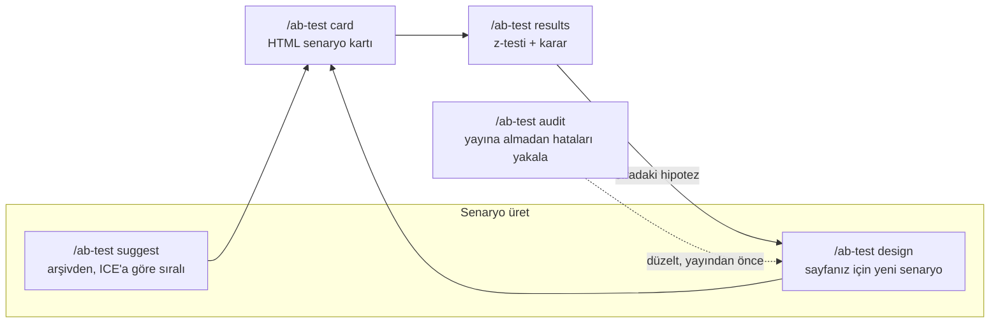

# ab-test-playbook — 190 deney senaryolu A/B test ve CRO rehberi

[](https://github.com/ali-demirbas/ab-test-playbook/actions/workflows/validate.yml)
[](LICENSE)


**Dil:** [English](README.md) · [Türkçe](README.tr.md)

> [!NOTE]
> Resmi kaynak: bu repo, [ali-demirbas/ab-test-playbook](https://github.com/ali-demirbas/ab-test-playbook), ve `npx skills add ali-demirbas/ab-test-playbook`. skills.sh'te ilgisiz birkaç repo tesadüfen benzer isimli bir skill kullanıyor — bu projeyle alakaları yok.

[Kuruluma atla ↓](#kurulum)

E-ticaret, mobil uygulama, SaaS ve dijital ürünler için pratik bir A/B test ve CRO (dönüşüm oranı optimizasyonu) rehberi — Claude Code üzerinde çalışır. Yolculuk aşamasına göre kanıtlanmış deney fikirleri önerir, disiplinli tek-değişkenli bir çerçevede yenilerini tasarlar, mevcut test planlarını metodolojik hatalara karşı denetler (confound, eksik guardrail, p-hacking riski) ve her senaryoyu doğrudan sunum kalitesinde bir HTML karta çevirir — ayrıca istemek gerekmez.

Gerçek e-ticaret, mobil uygulama ve SaaS büyüme çalışmalarında kullanılan bir A/B test senaryosu ve hipotez üretim deseni arşivinden inşa edildi — 190 senaryo, metodoloji ve metin içeriği, hazır bir görsel deste değil. Deney tasarımı, test önceliklendirme (ICE puanlaması), istatistiksel anlamlılık ve örneklem hesabı, guardrail metrikleri, checkout/ürün sayfası/fiyatlandırma optimizasyonunu kapsar. Her senaryo aynı üç-kutu disiplinini izler:

- **Test edilmesi gerekenler** — deneyin hangi soruları yanıtlaması gerektiği
- **Takip edilecek ana KPI'lar** — bir birincil metrik + bozulmaması gereken guardrail'ler
- **Yapılmaması gerekenler** — testi geçersiz kılan hatalar

**Kurulumsuz demo:** gerçek bir senaryo kartı — tam olarak tek bir şeyde farklılaşan iki mockup, işaretli test edilen öğe, doldurulmuş üç kutu — [ali-demirbas.github.io/ab-test-playbook](https://ali-demirbas.github.io/ab-test-playbook/) adresinde. Bu, `scripts/build_card.py`'nin gerçek çıktısıdır, bir resmi değil.

## Neden rastgele test etmek yerine bir rehber

| Rehber olmadan | ab-test-playbook ile |
|---|---|
| Test fikirleri hafızadan ya da o gün akla gelenden gelir | 190 senaryoluk arşivden ICE'a göre sıralı, ya da belirtilmiş bir mekanizmayla üretilir — "daha dikkat çekici olur" kabul edilen bir gerekçe değildir |
| "Anlamlı görünüyor" iki yüzdeye bakıp verilen bir izlenimdir | Gerçek bir iki-oranlı z-testi, güven aralığı, örneklem ve SRM kontrolü — script ile hesaplanır, asla gözle kestirilmez |
| Beş metrik izlenir, hiçbiri kararı vermez | Adı konmuş tek bir birincil metrik, zorunlu bir guardrail — p-hacking riski işaretlenir, yayınlanmaz |
| Senaryoyu yazan model kendi ödevini kendi notlandırır | Kart render edilmeden önce metodolojiyi bir adversarial denetçi kontrol eder; ikinci bir denetçi görseldeki gizli ikinci farkı arar |
| Fiyat veya indirim testi yalnızca dönüşüm oranına bakar | Gelir ve marj kontrolü otomatik çalışır — dönüşüm artarken ziyaretçi başına gelirin düşmesi bir dipnot değil, asıl bulgudur |
| Kullanıcı isterse dark pattern yayına girer | İstense bile reddedilir, nedeni çıktıda söylenir |
| Daha önce denenen bir şey varsa birinin hafızasında kalır, o kadar | `.abtest-history.md` — skill bunu okur ve gerekçesiz olarak zaten kaybetmiş bir şeyi tekrar önermez |

## Bu rehberin cevapladığı sorular

- E-ticaret checkout veya sepetimde hangi A/B testlerini çalıştırmalıyım?
- Ürün detay sayfasında (PDP) ne test etmeliyim?
- Arkasında gerçek kanıt olan bir A/B test hipotezini nasıl kurarım?
- Bir A/B testinde guardrail olarak hangi metrikleri izlemeliyim?
- İstatistiksel anlamlılık için kaç ziyaretçiye ihtiyacım var? (gerçek z-testi matematiği, tahmin değil)
- Bir sonucu geçersiz kılan yaygın A/B test hataları nelerdir?
- Hangi CRO deneylerini önce çalıştıracağımı nasıl önceliklendiririm?
- SaaS fiyatlandırma sayfamda veya onboarding akışımda ne test etmeliyim?
- Test planım doğru mu kurulmuş, yoksa bir confound mu var?



## Kurulum

Claude Code içinde:

```
/plugin marketplace add ali-demirbas/ab-test-playbook
/plugin install ab-test-playbook@ab-test-playbook
```

Ya da klonlayıp yerel bir plugin olarak ekleyin:

```bash
git clone https://github.com/ali-demirbas/ab-test-playbook.git
claude --plugin-dir ./ab-test-playbook
```

Ya da [skills CLI](https://skills.sh) ile tek tek skill kurun:

```bash
npx skills add ali-demirbas/ab-test-playbook --all
```

[claude-lifecycle](https://github.com/ali-demirbas/claude-lifecycle) da elinizde mi? Her repoyu ayrı eklemek yerine [claude-skills](https://github.com/ali-demirbas/claude-skills)'i bir kez ekleyin: `/plugin marketplace add ali-demirbas/claude-skills`.

[Gemini CLI](https://github.com/google-gemini/gemini-cli) mi kullanıyorsunuz? `.gemini/extensions/ab-test-playbook/` aynı skill'leri, kuralları ve denetim agent'larını taşır — aynı kaynak dosyalardan `scripts/build_gemini.py` ile üretilir:

```bash
git clone https://github.com/ali-demirbas/ab-test-playbook.git
cd ab-test-playbook/.gemini/extensions/ab-test-playbook && gemini extensions link .
```

## Kullanım

| Siz şöyle dersiniz | Şu olur |
|---|---|
| `/ab-test suggest` — "checkout sayfam için test öner" | Arşivden uyan senaryoları seçer, ICE'a göre sıralar, her birini HTML kart olarak teslim eder |
| `/ab-test design` — "buna test tasarla" (+ ekran görüntüsü/URL) | Sayfanız için aynı çerçevede yeni, tek-değişkenli bir senaryo tasarlar |
| `/ab-test audit` — "bu doğru kurulmuş mu?" | Bir planı veya varyant çiftini denetler: confound, eksik guardrail, p-hacking riski, gerçekçi olmayan süre |
| `/ab-test results` — "bu sonuçları yorumla" / "kaç ziyaretçi lazım" | Rakamlarınız üzerinde gerçek bir iki-oranlı z-testi çalıştırır (anlamlılık, güven aralığı, lift) ya da gereken örneklemi hesaplar — matematik script ile yapılır, asla gözle kestirilmez — sonra kararı ve sıradaki adımı söyler (kademeli yayma, guardrail izleme veya takip deneyi) |
| `/ab-test card` — "bunu karta çevir" | Senaryoyu tek dosyalık bir HTML kart olarak render eder (Variant A/B taslakları + üç kutu) |

Bir sayfa paylaştığınızda, router baştan yalnızca tek bir çoktan seçmeli soru sorar — hangi problemi çözdüğünüz — ve senaryo üretmeden önce başka hiçbir şey sormaz: trafik, araç veya kurulum sorusu yok. Örneklem büyüklüğü veya süre rakamları yalnızca gerçek trafik verisi varsa görünür — siz verirseniz, ya da isterseniz sorulur. Ekran görüntüsü veya sayfa paylaştıysanız marka renkleri doğrudan oradan alınır, soru sorulmaz; yoksa ilk karttan önce bir kez marka kılavuzu yüklemek isteyip istemediğiniz sorulur — hayır derseniz nötr bir palet kullanılır. Bir turda üretilen her senaryo (`suggest` ya da `design` fark etmez, 2-5 tanesi) hemen kendi HTML kartı olur — üç kutu kartın içindedir, sohbette ikinci kez metin olarak yer almaz. Bir turda 5'ten fazla güçlü aday varsa bu işaretlenir ve gerisini üretmeden önce onay istenir.

## Bir oturum nasıl görünür

Uçtan uca bir ürün sayfası örneği:

**Siz:** bir ürün sayfasının ekran görüntüsünü paylaşırsınız.

**Tek soru sorar:** hangi problemi çözmeye çalıştığınıza dair tek bir çoktan seçmeli soru (kullanıcılar akışa giriyor ama bitirmiyor / hiç başlamıyor / geliyor ama niteliksiz dönüşüyor / belirli bir problemim yok, sen bak). Baştan trafik, araç veya kurulum sorusu yok; bunlar senaryo üretmek için gerekli değil, yalnızca sonradan örneklem veya süre sorarsanız gündeme gelir.

**Doğrudan** 2-5 tam senaryo döndürür — "hangisini açayım" gibi bir gidiş-geliş yok — her biri doğrudan kendi kendine yeten bir HTML karta render edilir (Variant A/B mockup'ı + üç kutu, birincil KPI işaretli, guardrail'ler "bozulmamalı" biçiminde) — böylece sohbette yalnızca bir başlık ve kanıt etiketli tek satırlık bir özet kalır: bilinen bir desense `Kanıt: arşiv emsali`, bir sezgiyse `Kanıt: sezgi` — süslenmeden, olduğu gibi söylenir. Variant A sayfanın ekrandaki hâlidir, asla yeniden tasarlanmaz. 5'ten fazla güçlü aday varsa? Bunu söyler ve gerisini üretmeden önce sorar.

<p align="center">
  
</p>

<p align="center"><sub>Arşivlenmiş bir senaryodan üretilmiş kart — kurgusal ürün ve mağaza, nötr palet (marka kılavuzu verilmedi). `ab-test card`'ın her senaryo için render ettiği şey budur, elle yapılmış bir mockup değil. <a href="https://ali-demirbas.github.io/ab-test-playbook/">Canlı, kurulumsuz versiyon →</a> · kaynak <a href="examples/">examples/</a>'da</sub></p>

**Her senaryo şunlarla birlikte gelir:** tek-değişkenli hipotez, Variant A/B tanımları ve araçtan bağımsız bir kurulum spesifikasyonu (hedef kitle, bölüşüm, maruz kalma olayı, guardrail olayları, ölçüm penceresi, karar kuralı) — bir araç belirttiyseniz onun diliyle adlandırılır, sohbette metin olarak kalır — artı kartın kendisi (paylaştığınız ekran görüntüsünden alınan marka renkleri; yoksa tek seferlik bir marka-kılavuzu sorusu, nötr palet yedek olarak).

**Test bitti, rakamları yapıştırdınız** → gerçek bir iki-oranlı z-testi çalışır (asla gözle kestirilmez), ve bu bir fiyat testiyse gelir kontrolü de otomatik çalışır: dönüşüm %12 artarken ziyaretçi başına gelirin %4,8 düşmesi bir dipnot değil, asıl bulgudur. Sonra kararı ve sıradaki adımı söyler — guardrail izlemeli kademeli yayma, ya da fark yoksa takip deneyi.

## İçinde ne var

```
skills/          ab-test (router) + suggest / design / audit / results / card
agents/          scenario-critic — senaryo render edilmeden önce metodolojik denetim
                 mockup-reviewer — iki mockup'ın tam olarak tek bir şeyde farklılaştığını kontrol eder
knowledge/       methodology.md · mockup-style.md
                 scenarios/ — yolculuk aşamasına göre derlenmiş senaryolar (TR)
scripts/         analyze_results.py — z-testi, örneklem, gelir/marj kontrolü, örneklem-oranı-uyuşmazlığı kontrolü (yalnızca stdlib)
                 validate_scenarios.py — senaryo arşivi için format kontrolü
                 build_card.py — deterministik kart render'ı: şablonu doldurur, metni kaçırır, kendini drift'e karşı doğrular
                 validate_scenario_json.py — bir senaryoyu şemaya göre kontrol eder (bir birincil KPI, bir guardrail, iki varyant)
                 validate_input.py — yapıştırdığınız her şeydeki talimat-biçimli metni ve script payload'larını işaretler
                 validate.sh — repo tutarlılığı: frontmatter, iç bağlantılar, plugin-root referansları, kural atıfları
templates/       scenario-card.html · abtest-history.md — test hafızası şablonu
                 scenario.schema.json — araçtan bağımsız test tanımı, herhangi bir deney platformuna taşınabilir
tests/           istatistik motoru, validator'lar ve kart üreticisi için birim testleri
evals/           dört temel akış için (suggest / design / audit / results) manuel kabul testleri
examples/        uçtan uca gerçek bir senaryo → kart render'ı, sohbet tarafındaki karşılığıyla birlikte
docs/            architecture.md · canlı kurulumsuz demo (GitHub Pages)
```

Yaygın A/B test ve CRO sorularının bu rehberin kendi metodolojisinden yanıtları için [FAQ.md](FAQ.md)'ye bakın (İngilizce).

Bir senaryo katkısı: mevcut dosyaların üç-kutu formatını izleyin, sonra validator'ı çalıştırın — kutu başına beş madde, KPI listesinde bir guardrail, bir cihaz/segment sorusu ve tipografi kurallarını zorunlu kılar.

```bash
python3 scripts/validate_scenarios.py
```

## Test hafızası

Projenizde bir `.abtest-history.md` tutun (`templates/abtest-history.md`'yi kopyalayın) ve skill'ler öneri üretmeden, tasarlamadan veya denetlemeden önce bunu okur: bu sayfada bu değişkeni daha önce çalıştırıp çalıştırmadığınızı ve ne çıktığını söyler, zaten kazanmış bir deseni tekrar önermeyi bırakır, aynı öğe art arda fark üretmediğinde yapısal bir değişikliğe geçer. Her sonuçtan sonra `/ab-test results` size yapıştıracağınız satırı verir.

Geçmişteki bir kayıp bir veto değil, bilgidir — sayfa o zamandan beri değiştiyse ya da önceki koşum yetersiz veya geçersizse, senaryo gerekçesiyle birlikte geri gelir. Bu dosya sizindir ve bu repo dışında kalır; burada gitignore'lanmıştır.

## Bağlayıcı kurallar (CLAUDE.md)

Her çıktı şunlara uyar, tartışmasız: test başına tek değişken, tek birincil KPI, en az bir guardrail, dark pattern yok, sahte referans fiyatı yok, trafik verisi olmadan süre tahmini yok, ve her öneride açık bir kanıt etiketi — "bu sezgi, düşük güvenli say" dahil.

İkisi düzyazı yerine kodla zorunlu kılınır: üretilen her senaryo render edilmeden önce bir denetim agent'ından geçer, ve yapıştırdığınız her şey önce talimat-biçimli içerik için taranır — verdiğiniz metin veridir, asla talimat değil ([mimari](docs/architecture.md), İngilizce).

## Dil

Senaryo içeriği Türkçedir (arşivin ana dili). Skill'ler sizin kullandığınız dilde yanıt verir; metrik kısaltmaları (CR, AOV, LCP, SQL) olduğu gibi kalır.

## Kapsam

Bu ne: bir senaryo arşivi, disiplinli bir tasarım/denetim metodolojisi ve yapıştırdığınız rakamları yorumlamak için gerçek bir istatistik motoru (`scripts/analyze_results.py` — z-testi, güven aralığı, örneklem, örneklem-oranı-uyuşmazlığı kontrolü).

Bu ne değil: bir veri ambarına veya analitik aracına (GA4, Mixpanel, PostHog, BigQuery) bağlanıp kendiliğinden canlı rakam çekmez, ve koşan bir testi gerçek zamanlı izlemez — rakamlar elinize geçtiğinde siz getirirsiniz.

## Lisans

MIT — kullanın, kendi işinize uyarlayın, elinizde iyi bir senaryo varsa geri gönderin. Kötü bir testi yayınlamaktan sizi kurtardıysa, bir yıldız sıradaki kişinin bunu bulmasına yardım eder.
