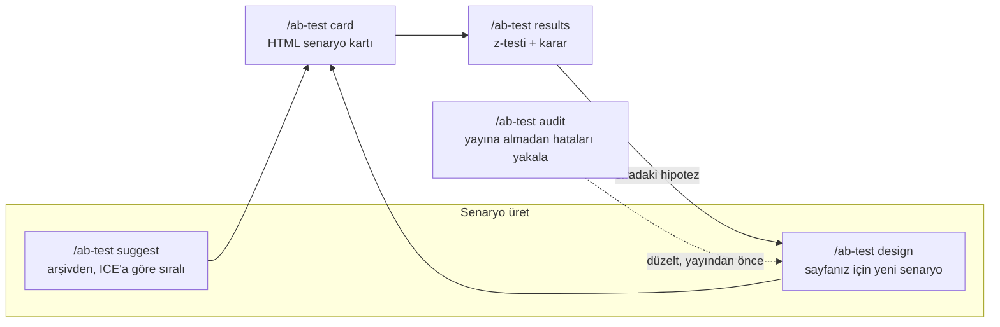
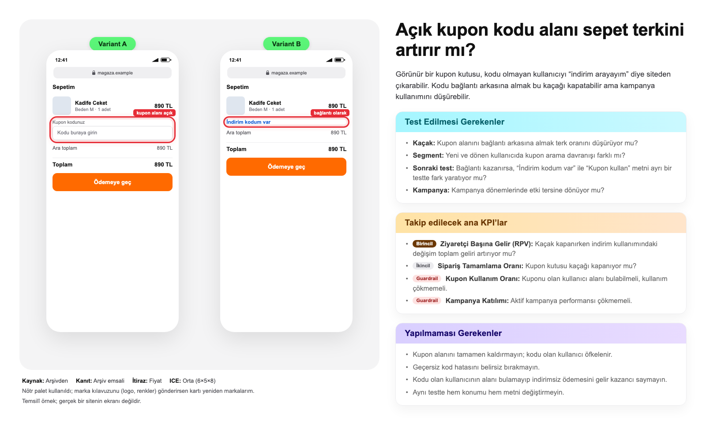

# ab-test-playbook — 221 deney senaryolu A/B test ve CRO rehberi

[](https://github.com/ali-demirbas/ab-test-playbook/actions/workflows/validate.yml)
[](LICENSE)


**Dil:** [English](README.md) · [Türkçe](README.tr.md)

[Kuruluma atla ↓](#kurulum)

E-ticaret, mobil uygulama, SaaS ve dijital ürünler için pratik bir A/B test ve CRO (dönüşüm oranı optimizasyonu) rehberi — Claude Code üzerinde çalışır. Yolculuk aşamasına göre kanıtlanmış deney fikirleri önerir, disiplinli tek-değişkenli bir çerçevede yenilerini tasarlar, mevcut test planlarını metodolojik hatalara karşı denetler (confound, eksik guardrail, p-hacking riski) ve her senaryoyu doğrudan sunum kalitesinde bir HTML karta çevirir — ayrıca istemek gerekmez.

Gerçek e-ticaret, mobil uygulama ve SaaS büyüme çalışmalarında, ayrıca düzenlemeye tabi finans, sigorta ve bireysel emeklilik akışlarında kullanılan bir A/B test senaryosu ve hipotez üretim deseni arşivinden inşa edildi: 221 senaryo, metodoloji ve metin içeriği, hazır bir görsel deste değil. Deney tasarımı, test önceliklendirme (ICE puanlaması), istatistiksel anlamlılık ve örneklem hesabı, guardrail metrikleri, checkout/ürün sayfası/fiyatlandırma optimizasyonunu kapsar. Her senaryo aynı üç-kutu disiplinini izler:

- **Test edilmesi gerekenler** — deneyin hangi soruları yanıtlaması gerektiği
- **Takip edilecek ana KPI’lar** — bir birincil metrik + bozulmaması gereken guardrail'ler
- **Yapılmaması gerekenler** — testi geçersiz kılan hatalar

**Kurulumsuz demo:** gerçek bir senaryo kartı — tam olarak tek bir şeyde farklılaşan iki mockup, işaretli test edilen öğe, doldurulmuş üç kutu — [ali-demirbas.github.io/ab-test-playbook](https://ali-demirbas.github.io/ab-test-playbook/) adresinde. Bu, `scripts/build_card.py`'nin gerçek çıktısıdır, bir resmi değil.

> [!NOTE]
> Resmi kaynak: bu repo, [ali-demirbas/ab-test-playbook](https://github.com/ali-demirbas/ab-test-playbook). Herkese açık skill dizinlerinde ilgisiz birkaç repo tesadüfen benzer isimli bir skill kullanıyor; bu projeyle alakaları yok.

## Neden rastgele test etmek yerine bir rehber

| Rehber olmadan | ab-test-playbook ile |
|---|---|
| Test fikirleri hafızadan ya da o gün akla gelenden gelir | 221 senaryoluk arşivden ICE’a göre sıralı ya da belirtilmiş bir mekanizmayla üretilir; “daha dikkat çekici olur” kabul edilen bir gerekçe değildir |
| "Anlamlı görünüyor" iki yüzdeye bakıp verilen bir izlenimdir | Gerçek bir iki-oranlı z-testi (küçük sayılarda kesin test), güven aralıkları, örneklem, A/B/n düzeltmesi ve SRM kontrolü. Script ile hesaplanır, asla gözle kestirilmez ve beyan ettiğiniz yöne göre okunur: anlamlı biçimde *kötü* bir varyant kaybeden olarak raporlanır, “anlamlı, yayına al” diye değil |
| Beş metrik izlenir, hiçbiri kararı vermez | Adı konmuş tek bir birincil metrik ve bağımsız bir zararı ölçen zorunlu bir guardrail; p-hacking riski işaretlenir, yayınlanmaz |
| Senaryoyu yazan model kendi ödevini kendi notlandırır | Kart render edilmeden önce metodolojiyi bir adversarial denetçi kontrol eder; ikinci bir denetçi görseldeki gizli ikinci farkı arar |
| Fiyat veya indirim testi yalnızca dönüşüm oranına bakar | Sipariş tutarını (ve varyantın marjını) sorar, gelir ve marj kontrolünü çalıştırır; dönüşüm artarken ziyaretçi başına gelirin düşmesi bir dipnot değil, asıl bulgudur |
| Kullanıcı isterse dark pattern yayına girer | İstense bile reddedilir, nedeni çıktıda söylenir |
| Daha önce denenen bir şey varsa birinin hafızasında kalır, o kadar | `.abtest-history.md` — skill bunu okur ve gerekçesiz olarak zaten kaybetmiş bir şeyi tekrar önermez |

## Bu rehberin cevapladığı sorular

- E-ticaret checkout veya sepetimde hangi A/B testlerini çalıştırmalıyım?
- Ürün detay sayfasında (PDP) ne test etmeliyim?
- Arkasında gerçek kanıt olan bir A/B test hipotezini nasıl kurarım?
- Bir A/B testinde guardrail olarak hangi metrikleri izlemeliyim?
- İstatistiksel anlamlılık için kaç ziyaretçiye ihtiyacım var? (gerçek z-testi matematiği, tahmin değil)
- Bir sonucu geçersiz kılan yaygın A/B test hataları nelerdir?
- Hangi CRO deneylerini önce çalıştıracağımı nasıl önceliklendiririm?
- SaaS fiyatlandırma sayfamda veya onboarding akışımda ne test etmeliyim?
- Test planım doğru mu kurulmuş, yoksa bir confound mu var?


```mermaid
flowchart LR
    subgraph Generate["Senaryo üret"]
        S["/ab-test suggest\narşivden, ICE'a göre sıralı"]
        D["/ab-test design\nsayfanız için yeni senaryo"]
    end
    C["/ab-test card\nHTML senaryo kartı"]
    R["/ab-test results\nz-testi + karar"]
    A["/ab-test audit\nyayına almadan hataları yakala"]

    S --> C
    D --> C
    C --> R
    R -->|sıradaki hipotez| D
    A -.->|düzelt, yayından önce| D
```

## Kurulum

**Gereksinimler:** Claude Code ve PATH üzerinde `python3` 3.9 veya üstü. Script'ler yalnızca Python standart kütüphanesini kullanır; `pip install` gerektiren bir şey yok. İsteğe bağlı tek ek: kartın görsel kontrolü (`scripts/render_check.mjs`) Node ile Chromium'lu Playwright ister; yoksa kartlar yine üretilir, kontrol atlanır.

Claude Code içinde:

```
/plugin marketplace add ali-demirbas/ab-test-playbook
/plugin install ab-test-playbook@ab-test-playbook
```

Ya da klonlayıp yerel bir plugin olarak ekleyin:

```bash
git clone https://github.com/ali-demirbas/ab-test-playbook.git
claude --plugin-dir ./ab-test-playbook
```

**Yalnızca skill'ler, sınırlı.** Skills CLI altı skill talimatını tek başına kopyalayabilir:

```bash
npx skills add ali-demirbas/ab-test-playbook --all
```

Bu yol her skill'in yalnızca `SKILL.md` dosyasını getirir. Bağlayıcı kurallar (`CLAUDE.md`), senaryo arşivi, script'ler ve denetim agent'ları gelmez. Her skill bunlara plugin kökü üzerinden ulaştığı için arşivden öneri, istatistik motoru ve kart üretimi çalışmaz. Motorun tamamı için yukarıdaki plugin kurulumunu kullanın.

[Gemini CLI](https://github.com/google-gemini/gemini-cli) mi kullanıyorsunuz? `.gemini/extensions/ab-test-playbook/` aynı skill'leri, kuralları ve denetim agent'larını taşır — aynı kaynak dosyalardan `scripts/build_gemini.py` ile üretilir:

```bash
git clone https://github.com/ali-demirbas/ab-test-playbook.git
cd ab-test-playbook/.gemini/extensions/ab-test-playbook && gemini extensions link .
```

## Kullanım

| Siz şöyle dersiniz | Şu olur |
|---|---|
| `/ab-test suggest` — "checkout sayfam için test öner" | Arşivden uyan senaryoları seçer, ICE'a göre sıralar, her birini HTML kart olarak teslim eder |
| `/ab-test design` — “buna test tasarla” (+ ekran görüntüsü, URL ya da kendi sayfanızın tarifi) | Sayfanız için aynı çerçevede yeni, tek-değişkenli bir senaryo tasarlar |
| `/ab-test audit` — "bu doğru kurulmuş mu?" | Bir planı veya varyant çiftini denetler: confound, eksik ya da yanlış kurulmuş guardrail, düzenlenen alan ve uyum kapıları, p-hacking riski, gerçekçi olmayan süre |
| `/ab-test results` — "bu sonuçları yorumla" / "kaç ziyaretçi lazım" | Önce trafik bölüşümünü SRM için kontrol eder, sonra rakamlarınız üzerinde istatistiği çalıştırır: anlamlılık (z-testi, nadir olaylarda Fisher kesin testi, A/B/n için Holm düzeltmesi), ziyaretçi başına gelir gibi sürekli metrikler (Welch, bootstrap, CUPED), isteğe bağlı Bayes görünümü ya da gereken örneklem. Elinizde ön kayıt bloğu varsa alan alan geri okunur (yön, alfa, guardrail marjları, geciken pencereler, geçti/kaldı kontrolleri). Matematik script ile yapılır, asla gözle kestirilmez; ardından kararı ve sıradaki adımı söyler (kademeli yayma, guardrail izleme veya takip deneyi) |
| `/ab-test card` — "bunu karta çevir" | Senaryoyu tek dosyalık bir HTML kart olarak render eder (Variant A/B taslakları + üç kutu) |
| Yalnızca `/ab-test` | Her alt komut için birer örnek istemle beş satırlık bir menü gösterir, soru sormaz |

Bir sayfa paylaştığınızda (ekran görüntüsü, URL ya da kendi sayfanızın tarifi), router baştan yalnızca tek bir çoktan seçmeli soru sorar: hangi problemi çözdüğünüz. Senaryo üretmeden önce başka hiçbir şey sormaz; trafik, araç veya kurulum sorusu yok. Mesajınız problemi zaten söylüyorsa bu soru atlanır. Örneklem büyüklüğü veya süre rakamları yalnızca gerçek trafik verisi varsa görünür — siz verirseniz, ya da isterseniz sorulur. Marka kaynağı akışı hiçbir zaman durdurmaz: ekran görüntüsü veya sayfa paylaştıysanız marka renkleri doğrudan oradan alınır; yoksa nötr palet kullanılır ve kartın altına, marka kılavuzu gönderirseniz kartı yeniden renklendirmeyi öneren tek satırlık bir not eklenir. Soru sorulmaz, cevap beklenmez. Bir turda üretilen her senaryo (`suggest` ya da `design` fark etmez, 1-5 tanesi) hemen kendi HTML kartı olur; üç kutu kartın içindedir, sohbette ikinci kez metin olarak yer almaz. Liste asla şişirilmez: tek güçlü senaryo tam bir yanıttır, sayıyı tamamlamak için zayıf aday eklenmez. Açıkça istediğiniz bir test her zaman üretilir; zayıfsa zayıflığı söylenir ve daha güçlü alternatifin adı verilir. 5'ten fazla güçlü aday varsa en iyi 5'i üretilir, gerisi tek satırla teklif edilir. Bir tur en fazla bir soru sorar; gereken diğer bilgiler varsayım olarak belirtilir ve sonraki turda sorulur.

## Bir oturum nasıl görünür

Uçtan uca bir ürün sayfası örneği:

**Siz:** bir ürün sayfasının ekran görüntüsünü paylaşırsınız.

**Tek soru sorar:** hangi problemi çözmeye çalıştığınıza dair tek bir çoktan seçmeli soru (kullanıcılar akışa giriyor ama bitirmiyor / hiç başlamıyor / geliyor ama niteliksiz dönüşüyor / belirli bir problemim yok, sen bak). Baştan trafik, araç veya kurulum sorusu yok; bunlar senaryo üretmek için gerekli değil, yalnızca sonradan örneklem veya süre sorarsanız gündeme gelir.

**Doğrudan** 1-5 tam senaryo döndürür — "hangisini açayım" gibi bir gidiş-geliş yok — her biri doğrudan kendi kendine yeten bir HTML karta render edilir (Variant A/B mockup'ı + üç kutu, birincil KPI işaretli, guardrail'ler "bozulmamalı" biçiminde) — böylece sohbette yalnızca bir başlık ve kanıt etiketli tek satırlık bir özet kalır: bilinen bir desense `Kanıt: arşiv emsali`, bir sezgiyse `Kanıt: sezgi` — süslenmeden, olduğu gibi söylenir. Variant A sayfanın ekrandaki hâlidir, asla yeniden tasarlanmaz. Tek güçlü senaryo tam bir yanıttır; kota doldurmak için zayıf aday eklenmez. 5'ten fazla güçlü aday mı var? En iyi 5'ini üretir, gerisini teklif eder.

<p align="center">
  
</p>

<p align="center"><sub>Arşivlenmiş bir senaryodan üretilmiş kart — kurgusal ürün ve mağaza, nötr palet (marka kılavuzu verilmedi). `ab-test card`'ın her senaryo için render ettiği şey budur, elle yapılmış bir mockup değil. <a href="https://ali-demirbas.github.io/ab-test-playbook/">Canlı, kurulumsuz versiyon →</a> · kaynak <a href="examples/">examples/</a>'da</sub></p>

**Her senaryo şunlarla birlikte gelir:** tek-değişkenli hipotez, Variant A/B tanımları ve araçtan bağımsız bir kurulum spesifikasyonu (hedef kitle, bölüşüm, maruz kalma olayı, guardrail olayları, ölçüm penceresi, karar kuralı) — bir araç belirttiyseniz onun diliyle adlandırılır, sohbette metin olarak kalır. Bunlara ek olarak birincil metriği ve yönünü, guardrail’leri (ölçülen her guardrail bir marj taşır; erişilebilirlik kontrolü gibi geçti/kaldı guardrail’leri bir ölçüt, iade gibi geciken bir guardrail okuma penceresini taşır), alfa değerini, trafik paylarını ve karar kuralını test başlamadan sabitleyen bir JSON ön kayıt (pre-registration) bloğu ve kartın kendisi gelir (paylaştığınız ekran görüntüsünden alınan marka renkleri; yoksa nötr palet ve kartın altında tek satırlık bir yeniden renklendirme teklifi).

**Test bitti, rakamları yapıştırdınız** → önce trafik bölüşümü SRM için kontrol edilir (bölüşüm bozuksa analiz orada durur), sonra gerçek bir anlamlılık testi çalışır (asla gözle kestirilmez) ve beyan edilen yöne göre okunur; bu bir fiyat testiyse sipariş tutarını sorar ve gelir kontrolünü de çalıştırır: dönüşüm %12 artarken ziyaretçi başına gelirin %4,8 düşmesi bir dipnot değil, asıl bulgudur. Sonra kararı ve sıradaki adımı söyler: guardrail izlemeli kademeli yayma, fark yoksa takip deneyi, geciken bir guardrail’in penceresi henüz kapanmadıysa “geçici” karar. Yayına almak için birincil metriğin beyan edilen yönde anlamlı ve bütün guardrail’lerin temiz olması gerekir.

## İçinde ne var

```
skills/          ab-test (router) + suggest / design / audit / results / card
agents/          scenario-critic — senaryo render edilmeden önce metodolojik denetim
                 mockup-reviewer — iki mockup'ın tam olarak tek bir şeyde farklılaştığını kontrol eder
knowledge/       methodology.md · mockup-style.md · kpi-glossary.md (99 kanonik KPI adı, her biri paydasıyla)
                 scenarios/ — 13 aşama dosyasında derlenmiş senaryolar (TR): ana sayfa ve landing, arama ve filtreleme,
                 kategori, ürün detay, sepet ve ödeme, teşekkür sayfası, panel, form ve kayıt, fiyatlandırma,
                 mobil uygulama, SaaS/B2B, arayüz öğeleri, finans, sigorta ve bireysel emeklilik
scripts/         analyze_results.py — yön taşıyan kararla z-testi (küçük örneklemde Fisher kesin testi), Holm düzeltmeli A/B/n, guardrail non-inferiority, örneklem, SRM, sürekli metrikler (Welch, bootstrap, CUPED), Bayes görünümü (yalnızca stdlib)
                 validate_scenarios.py — senaryo arşivi için format kontrolü
                 build_card.py — deterministik kart render'ı: şablonu doldurur, metni kaçırır, kendini drift'e karşı doğrular
                 validate_scenario_json.py — bir senaryoyu şemaya göre kontrol eder (bir birincil KPI, bir guardrail, iki varyant)
                 validate_input.py — dosya olarak verdiğiniz girdideki talimat-biçimli metni ve script payload'larını işaretler
                 validate.sh — repo tutarlılığı: frontmatter, iç bağlantılar, plugin-root referansları, kural atıfları
                 check_frontmatter.py — her skill ve agent frontmatter'ını kurulum araçlarının okuduğu gibi ayrıştırır
                 build_gemini.py · build_llms_full.py — Gemini CLI eklentisini ve docs/llms-full.txt dosyasını üretir
                 canary_report.py — arşivin atıfsız kopyalarını bulmak için ayırt edici arama ifadeleri türetir
                 render_check.mjs — kartı headless Chromium'da render eder (isteğe bağlı; Node ve Playwright ister)
templates/       scenario-card.html · abtest-history.md · abtest-backlog.md (test hafızası ve backlog şablonları)
                 scenario.schema.json — araçtan bağımsız test tanımı, herhangi bir deney platformuna taşınabilir
tests/           istatistik motoru, validator'lar ve kart üreticisi için birim testleri
evals/           manuel kabul testleri: dört temel akış, ortak kurallar (tur başına tek soru, ret, enjeksiyon), kart gerçekçiliği,
                 düzenlemeye tabi sigorta/emeklilik akışı, kullanıcının ısrarla istediği zayıf test, ön kayıtla okunan sonuç ve İngilizce konuşma
examples/        uçtan uca gerçek bir senaryo → kart render'ı, gerçek script çıktılı bir sonuç yorumu örneği ve kusurlu bir planın denetimi
docs/            architecture.md · canlı kurulumsuz demo (GitHub Pages)
```

Yaygın A/B test ve CRO sorularının bu rehberin kendi metodolojisinden yanıtları için [FAQ.md](FAQ.md)'ye bakın (İngilizce).

Bir senaryo katkısı: mevcut dosyaların üç-kutu formatını izleyin, sonra repo kontrollerini çalıştırın. İçlerindeki senaryo validator'ı arşiv dosyaları için kutu başına beş madde, bir `Değişken: … · Fark: …` satırı, KPI listesinde bir guardrail, bir cihaz/segment sorusu ve tipografi kurallarını zorunlu kılar. (Kendi sayfanız için tasarlanan bir senaryo kutu başına 3 ile 6 madde taşır.) Ayrıntılar [CONTRIBUTING.md](CONTRIBUTING.md) dosyasında (İngilizce).

```bash
bash scripts/validate.sh
```

## Test hafızası

Projenizde bir `.abtest-history.md` tutun (`templates/abtest-history.md`'yi kopyalayın) ve skill'ler öneri üretmeden, tasarlamadan veya denetlemeden önce bunu okur: bu sayfada bu değişkeni daha önce çalıştırıp çalıştırmadığınızı ve ne çıktığını söyler, zaten kazanmış bir deseni tekrar önermeyi bırakır, aynı öğe art arda fark üretmediğinde yapısal bir değişikliğe geçer. Her sonuçtan sonra `/ab-test results` satırı yazar ve eklemeyi teklif eder; yalnızca siz onaylarsanız eklenir, yoksa kendiniz yapıştırırsınız. İsteğe bağlı bir `.abtest-backlog.md` (`templates/abtest-backlog.md` dosyasını kopyalayın) henüz koşmadığınız sıralı adayları tutar; `/ab-test suggest` buraya eklemeyi aynı şekilde teklif eder.

Geçmişteki bir kayıp bir veto değil, bilgidir — sayfa o zamandan beri değiştiyse ya da önceki koşum yetersiz veya geçersizse, senaryo gerekçesiyle birlikte geri gelir. Bu dosya sizindir ve bu repo dışında kalır; burada gitignore'lanmıştır.

## Bağlayıcı kurallar (CLAUDE.md)

Her çıktı şunlara uyar, tartışmasız: test başına tek değişken, tek birincil KPI, en az bir guardrail, dark pattern yok, sahte referans fiyatı yok, trafik verisi olmadan süre tahmini yok, ve her öneride açık bir kanıt etiketi — "bu sezgi, düşük güvenli say" dahil.

İkisi yazanın kendi takdirine bırakılmaz, ayrı bir adımla desteklenir: üretilen her senaryo render edilmeden önce bir denetim agent'ı tarafından incelenir ve dosya olarak gelen her girdi önce `validate_input.py` ile talimat-biçimli içerik için taranır. Verdiğiniz metin, taransa da yapıştırılsa da veridir, asla talimat değildir ([mimari](docs/architecture.md), İngilizce).

## Dil

Senaryo içeriği Türkçedir (arşivin ana dili). Skill'ler sizin kullandığınız dilde yanıt verir; metrik kısaltmaları (CR, AOV, LCP, SQL) olduğu gibi kalır.

## Kapsam

Bu ne: bir senaryo arşivi, disiplinli bir tasarım/denetim metodolojisi ve yapıştırdığınız rakamları yorumlamak için gerçek bir istatistik motoru (`scripts/analyze_results.py` — kesin test yedekli z-testi, A/B/n, örneklem, SRM, CUPED’li sürekli metrikler, Bayes görünümü).

Bu ne değil: bir veri ambarına veya analitik aracına (GA4, Mixpanel, PostHog, BigQuery) bağlanıp kendiliğinden canlı rakam çekmez, ve koşan bir testi gerçek zamanlı izlemez; rakamlar elinize geçtiğinde siz getirirsiniz. Düzenlemeye tabi akışlarda (sigorta, emeklilik, kredi) zorunlu bir bilgilendirmeyi, bir onay adımını ya da kimlik doğrulamayı asla test konusu yapmaz; düzenlenen bir gösterimi değiştiren varyantı hedef pazarın kuralı doğrulanana kadar bekletir, böyle bir akışın içindeki diğer her test için uyum onayını yayın öncesi kapı yapar. Hukuki tavsiye değildir.

## Lisans

MIT — kullanın, kendi işinize uyarlayın, elinizde iyi bir senaryo varsa geri gönderin. Kötü bir testi yayınlamaktan sizi kurtardıysa, bir yıldız sıradaki kişinin bunu bulmasına yardım eder.
